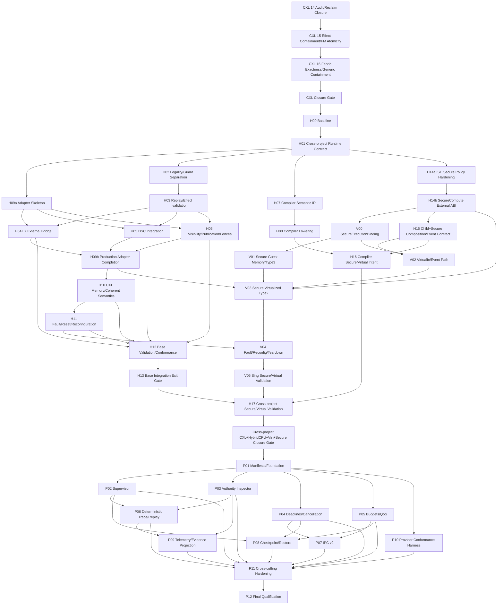

# SingNextOS Master Refactoring Execution Plan

Status: proposed cross-roadmap execution schedule.

This document is the orchestration layer for the following roadmaps:

1. [`cxl-refactoring-roadmap/`](./cxl-refactoring-roadmap/)
2. [`hybridcpu-cxl-refactoring-roadmap/`](./hybridcpu-cxl-refactoring-roadmap/)
3. [`virtualization-securecompute-cxl-refactoring-roadmap/`](./virtualization-securecompute-cxl-refactoring-roadmap/)
4. [`post-cxl-operability-refactoring-roadmap/`](./post-cxl-operability-refactoring-roadmap/)

It does not replace those roadmaps. It defines **when work may start, which phases may run in parallel, which gates block integration/promotion, and which repository owns each implementation slice**.

---

## 1. Current execution assumption

The starting project state for this plan is:

- the SingNextOS CXL software/model roadmap is almost closed and its latest hardening phases are the immediate starting point;
- `hybridcpu-cxl-refactoring-roadmap` has not started as an implementation program;
- `virtualization-securecompute-cxl-refactoring-roadmap` has not started as an implementation program;
- `post-cxl-operability-refactoring-roadmap` has not started as an implementation program.

The CXL roadmap documentation currently records Phases 14, 15 and 16 as complete for staged single-host software/model scope. This master plan nevertheless begins with a **CXL closure revalidation gate**, because later roadmaps must consume the current implementation, not documentation claims alone.

If current `master` already satisfies the Phase 14/15/16 evidence and final software validation, the CXL launch wave is a short verification/closure wave rather than a reimplementation wave.

CXL Phase 8 QEMU/FPGA/physical-hardware work remains explicitly outside the software/model critical path unless that scope is separately reopened. `DirectCoherentWrite` remains FutureGated and is not a blocker for the roadmap sequence below.

---

## 2. Global scheduling rules

### 2.1 Phase number is not launch order

Roadmap phase numbers organize documentation. They do **not** imply that all implementation work must be performed numerically.

Examples:

- HybridCPU Phase 9 (`ExternalRuntime SingNextOS Adapter`) has an early adapter-skeleton slice that should start immediately after the Phase-1 contract freeze, before lane migration.
- HybridCPU compiler Phases 7/8 can run in parallel with CPU legality/replay work once the common semantic contract is frozen.
- SingNextOS secure/virtual composition can be implemented behind an unavailable/fake provider path while HybridCPU secure external enforcement is still being completed, but it cannot be promoted as ProductionSecure before the positive external path is proven.

### 2.2 Dependency classes

Every dependency in this plan is one of three classes.

**Hard start dependency** — implementation of the dependent slice must not begin before the prerequisite contract/state exists.

**Integration dependency** — local/fake implementation may begin, but integration cannot merge as the production path until the dependency is satisfied.

**Promotion dependency** — code may merge fail-closed behind a feature gate, but the advertised capability level cannot be promoted until the prerequisite and negative matrix pass.

### 2.3 Contract-owner rule

Once a shared contract is frozen for a wave, exactly one workstream owns modifications to that contract until dependent branches merge. Parallel branches consume the frozen contract and must not create competing semantic sources of truth.

### 2.4 No weakened fallback

A later roadmap may not weaken an earlier invariant to unblock itself. Missing prerequisites are fixed in the owning earlier roadmap.

In particular:

- evidence never becomes authority;
- replay evidence never becomes permission to submit a live effect;
- completion never silently becomes visibility/publication;
- provider unavailability never becomes proof of closure;
- zero-copy never becomes an ABI promise;
- CXL topology never becomes ordinary guest/application authority;
- restart/checkpoint never resurrect stale provider authority.

---

## 3. Workstream ownership

| Workstream | Primary owner | Scope |
|---|---|---|
| **A — CXL closure** | SingNextOS | CXL Phases 14–16 revalidation, final software/model closure |
| **B — HybridCPU runtime/ISE** | HybridCPU-v2 | ExternalRuntime contracts, legality, replay, lane integrations, secure external ABI |
| **C — Compiler** | HybridCPU-v2 `Compilers/` | provider-neutral semantic IR, lowering, secure/virtual intent |
| **D — Sing secure/virtual composition** | SingNextOS | SecureExecutionBinding, guest memory, VirtualIo/events, exact Type-2 context, fault orchestration |
| **E — Cross-project qualification** | both repositories | fake/real adapter matrices, stale/ambiguous/fault tests, feature promotion |
| **F — Post-CXL operability** | SingNextOS | manifests, supervisor, inspector, cancellation, budgets, tracing, IPC v2, checkpoint, telemetry, conformance |

The HybridCPU roadmap is stored in SingNextOS for coordination, but implementation of HybridCPU-owned phases belongs in `yuriyyak23/HybridCPU-v2`.

---

## 4. Master dependency DAG

The graph below shows the high-level critical dependencies. Detailed parallel launch rules follow in later sections.



---

# PART I — Close the CXL foundation first

## 5. Wave 0 — CXL closure and revalidation

### 5.1 Execution order

Run the final CXL closure in this order:

1. **CXL Phase 14 — Audit Hardening and Reclaim Closure**
2. **CXL Phase 15 — Provider Effect Containment and FM Atomicity**
3. **CXL Phase 16 — Fabric Exactness and Generic Effect Containment**
4. final Phase-11/14/15/16 negative matrix;
5. final software/model validation against the current `master` baseline.

These phases are serial at the semantic level because Phase 15 strengthens Phase 14 closure semantics and Phase 16 strengthens Phase 15 exactness/containment semantics.

### 5.2 What may run in parallel

While the CXL qualification suite is running/fixing regressions, teams may prepare **non-merging** HybridCPU baseline analysis for H00, but no later runtime contract should be declared frozen until the CXL closure gate is satisfied.

### 5.3 CXL Closure Gate `CG`

The gate is satisfied when current implementation evidence proves, at minimum:

- `ProviderUnavailable != ProviderClosed != ProviderEffectContained`;
- stale destructive handles cannot delete/release a replacement generation;
- malformed or ambiguous effect creation retains the authority required for recovery;
- Type-2 admission is atomic with Fabric Manager drain/reconfiguration;
- Type-3 backing and provider-created identities remain pinned on ambiguous closure;
- post-effect exceptions are contained/quarantined rather than treated as zero-effect failures;
- CXL binding identity distinguishes same-endpoint/same-generation bindings where required;
- teardown/reclaim requires exact closure or independently proven containment.

If this already passes on current `master`, mark Wave 0 complete and immediately open Wave 1.

### 5.4 Not blockers

The following do not block `CG`:

- CXL Phase 8 hardware/QEMU/FPGA work when user scope remains skipped;
- `DirectCoherentWrite`;
- secure writable multi-host memory;
- secure CXL P2P;
- transparent confidential migration.

---

# PART II — HybridCPU base integration

## 6. Wave 1 — Contract freeze and adapter skeleton

### 6.1 Serial root

After `CG`:

1. **H00 — baseline gap matrix and decisions**
2. **H01 — cross-project runtime contract**

H00 is short but mandatory: it refreshes current HybridCPU-v2/SingNextOS code reality before implementation starts.

H01 is the first major contract freeze and must establish the provider-neutral lifecycle:

```text
Prepared -> Admitted -> Submitted -> DeviceComplete -> Visible -> Published -> Released
```

with opaque generation/effect identity and no CXL topology leakage.

### 6.2 Parallel launch after H01

Once H01 contract types/versioning are frozen, launch four branches in parallel:

**B1 — H09a ExternalRuntime adapter skeleton**

- fake/in-process transport;
- lifecycle correlation;
- version negotiation;
- error taxonomy;
- no production provider promotion yet.

**B2 — H02 legality/GuardPlane separation**

- CPU legality remains CPU legality;
- OS admission remains a separate runtime gate;
- no CXL/Sing provider value added to `LegalityAuthoritySource`.

**C1 — H07 compiler semantic IR**

- provider-neutral external operation intent;
- no topology handles;
- no live authority in compiler IR.

**B3 — H14a ISE SecureCompute policy hardening**

- make secure operation dispatch exhaustive;
- unsupported/unknown secure operation classes deny by default;
- activate explicit evidence/migration policy denial outcomes.

These branches share semantics but should touch mostly separate modules and are therefore the first major parallelization point.

### 6.3 Merge order inside Wave 1

Recommended merge order:

1. H01 contract foundation;
2. H09a adapter skeleton;
3. H02 legality split and H14a secure-policy hardening in either order;
4. H07 compiler IR independently once contract names/version are stable.

Compiler work must not block runtime legality work and vice versa.

---

## 7. Wave 2 — Replay, compiler lowering, and SecureCompute external ABI

After the relevant Wave-1 branches merge, run these tracks in parallel.

### Track B — HybridCPU runtime

**H03 — Replay Effect Model and Invalidation**

Hard dependencies:

- H01 contract;
- H02 legality separation;
- H09a fake adapter sufficient to drive lifecycle tests.

H03 is a hard prerequisite for any production lane migration because duplicate external submit must be impossible before external execution is enabled.

### Track C — Compiler

**H08 — compiler lowering/admission/bundling**

Hard dependency: H07 semantic IR.

Integration dependency: H01 contract version and descriptor semantics.

H08 can proceed in parallel with H03 because it lowers semantic intent, not live authority.

### Track B-secure — HybridCPU SecureCompute

**H14b — versioned SecureCompute ExternalRuntime contract + implementation contour**

Hard dependencies:

- H01 versioning/ownership discipline;
- H14a exhaustive ISE policy dispatch.

H14b must establish owner-bound secure-domain/secure-region handles, generations, exact close receipts, proven property reporting, and the real distinction between `Executable` and `ProductionSecure`.

### Early Sing preparation allowed

Once the H14b contract shape is frozen, SingNextOS may begin the internal data-model portion of V00 behind a fail-closed unavailable/fake provider path. This is an **integration dependency**, not permission to advertise ProductionSecure.

---

# PART III — HybridCPU execution paths and secure composition

## 8. Wave 3 — External execution lanes, publication semantics, and secure composition

After H03 is complete, launch the following HybridCPU work.

### 8.1 H04 and H05

- **H04 — lane7/L7-SDC external-operation bridge**
- **H05 — lane6/DmaStreamCompute integration**

Both require:

- H01;
- H02;
- H03;
- H09a adapter skeleton.

They are semantically independent and **may run in parallel with separate owners** because lane6 and lane7 must remain distinct.

However, they are likely to share ExternalRuntime plumbing. If the same engineer owns both or merge conflicts are high, prefer H04 then H05 rather than forcing parallelism.

### 8.2 H06

**H06 — commit/visibility/publication/fences** may begin in parallel with H04/H05 after H03.

Its final integration test depends on at least one migrated execution lane. It must preserve:

```text
DeviceComplete != Visible != Published != Released
```

### 8.3 H15

**H15 — secure virtualization composition and event publication** starts after H14b has a stable SecureCompute external ABI.

It may develop in parallel with H04/H05/H06, but its executable event path needs the child-domain adapter/runtime path and therefore has an integration dependency on the production ExternalRuntime work.

### 8.4 V00 begins in parallel

**V00 — SingNextOS SecureExecutionBinding** starts after the H14b external contract is stable enough to target.

Development mode:

- local capability/generation composition;
- fake provider tests;
- fail-closed unavailable provider behavior;
- quarantine/teardown semantics.

Promotion dependency:

- real HybridCPU secure external implementation;
- qualified adapter;
- no `ProductionSecure` promotion before cross-project tests.

---

## 9. Wave 4 — Production adapter completion and Sing secure/virtual memory/I/O branches

### 9.1 H09b production adapter completion

Finalize H09 after H04/H05/H06 establish the real external execution semantics.

H09b must support:

- exact submit correlation;
- completion/visibility/publication/release;
- reset/reconfiguration notification;
- transport failure distinct from provider rejection;
- exact generation invalidation;
- child/secure capability families where available.

### 9.2 SingNextOS parallel branches

After V00 local model is stable, launch these two Sing branches in parallel.

**V01 — secure guest memory + CXL Type-3 composition**

Hard dependencies:

- V00;
- CXL `CG`;
- ordinary guest mapping infrastructure.

The secure overlay must reuse the exact existing parent platform mapping. No duplicate mapping and no `CxlGuestMemory` authority type.

**V02 — VirtualIo/events/CXL.io**

Hard dependencies:

- V00 for secure I/O composition where secure mode is used;
- existing DeviceLease/VirtualIo infrastructure;
- CXL `CG`.

Integration dependency:

- H15 event forwarding for executable HybridCPU child publication.

V02 may merge local/fake tests before H15 is fully executable, but production event promotion waits for the HybridCPU event path.

### 9.3 Compiler H16 preparation

H16 secure/virtual compiler semantics may begin once H07/H08 are merged and H14/H15 semantic requirements are frozen. It does not need to wait for V03 implementation because it carries semantic intent only.

---

# PART IV — Exact secure virtualized CXL execution

## 10. Wave 5 — HybridCPU CXL semantics/faults and Sing Type-2 exact context

### 10.1 HybridCPU base completion branch

Run:

1. **H10 — CXL memory/coherent access semantics**
2. **H11 — fault/reset/reconfiguration/cancellation**

H10 requires `CG` plus stable ExternalRuntime semantics; H11 requires H10 plus the production lifecycle/adapter path.

H11 is particularly important for the Sing secure/virtual fault orchestration because HybridCPU must already distinguish stale, reset, ambiguous, cancellation and publication-failure outcomes.

### 10.2 V03 — secure virtualized Type-2 compute

Start V03 after:

- V00 complete;
- V01 and V02 contract/lifecycle foundations are available;
- H14b secure ABI exists;
- H09b production adapter lifecycle exists;
- CXL Type-2 staged path is available from `CG`.

V03 must replace provider-capability-only decisions with an exact runtime context containing the concrete VirtualDomain, optional SecureExecutionBinding, guest mappings, and VirtualIo/parent DeviceLease relation.

### 10.3 H16 — compiler secure/virtual intent

H16 may execute in parallel with V03 after H15 semantics are frozen.

Its promotion gate is compile-to-runtime conformance proving that semantic intent maps to exact runtime context rather than becoming authority itself.

---

## 11. Wave 6 — Fault orchestration and base validation

Two parallel branches should now converge.

### HybridCPU branch

**H12 — validation/negative tests/conformance** followed by the H13 base integration exit gate.

H12 consumes H04/H05/H06/H09/H10/H11 and compiler H07/H08 for the original external-operation/CXL contour.

H13 is an integration/closure checkpoint, not a reason to serialize all previous work.

### SingNextOS branch

**V04 — fault/reconfiguration/teardown/reclaim**

Hard dependencies:

- V03;
- H11 semantic fault/reset model;
- CXL Phase-15/16 closure semantics.

V04 joins CXL hot-remove/FM drain/security reset/device reset to VM park/drain/quarantine and exact resource closure.

### Parallel QA work

Cross-project test fixtures for H17/V05 should be built while H12 and V04 are finishing. They may not declare final success until both code paths are merged.

---

## 12. Wave 7 — Cross-project closure gate

Run **V05** and **H17** as one coordinated qualification program.

Required inputs:

- H13 base HybridCPU external-operation closure;
- H14/H15 secure external composition;
- H16 compiler secure/virtual semantic intent;
- V00–V04 SingNextOS implementation;
- CXL `CG`.

### Mandatory cross-project scenarios

At minimum prove:

- Type-3 `OwnedRegion` -> guest mapping -> executable child -> exact teardown;
- same mapping lineage -> secure guest protection;
- CXL.io -> DeviceLease -> bounded VirtualIo -> exact close;
- secure+virtual CXL Type-2 effect with exact mappings/domain/device authority;
- stale child, secure, guest mapping, backing, fabric and security generations;
- FM reconfiguration during live guest accelerator work;
- Type-3 hot-remove while guest memory is live;
- security reset after DeviceComplete and before Published;
- ambiguous provider closure blocks region/mapping/domain reclaim;
- malformed secure creation with failed compensation remains quarantined/recoverable;
- virtual event occurs only after visibility + revalidation + publication;
- compiler IR carries semantic requirements but no raw CXL topology;
- unsupported secure operation classes deny by default.

### Cross-project Closure Gate `XG`

Only after this matrix passes may the stack be considered ready for the post-CXL operability roadmap.

`XG` means:

- base CXL authority/effect semantics are stable;
- HybridCPU external execution is generation- and replay-safe;
- SecureCompute has a real positive external enforcement contour;
- VirtualDomain and SecureDomain compose through exact bindings;
- CXL-backed secure virtualized effects have exact admission/fault/closure paths;
- feature promotion is backed by negative evidence, not capability bits alone.

---

# PART V — Post-CXL operability roadmap

## 13. Hard rule for launching post-CXL implementation

The post-CXL roadmap explicitly assumes CXL, HybridCPU integration, Virtualization and SecureCompute are completed prerequisites.

Therefore **P01 production implementation starts only after `XG`**.

Documentation/test design may be prepared earlier, but earlier preparation is not counted as starting a post-CXL phase and must not introduce compatibility shortcuts around unfinished prerequisites.

---

## 14. Wave 8 — Post-CXL foundation and first parallel fan-out

### 14.1 P01 first

**P01 — foundation contracts and declarative manifests** is the root of the post-CXL tree.

Freeze:

- ServiceId/ServiceGeneration/ServiceInstanceHandle;
- dependency declarations;
- requested/granted/degraded admission vocabulary;
- service manifest schema;
- policy declarations for restart/drain/checkpoint/telemetry;
- normalized configuration correlation.

A manifest remains descriptive and never mints authority.

### 14.2 Parallel fan-out after P01

Launch five branches in parallel where staffing permits:

**P02 — Capability-aware Service Supervisor**

- service lifecycle;
- dependency graph;
- generation-changing restart;
- drain/replace;
- capability-safe rebinding.

**P03 — Authority/Capability Inspector + provenance graph**

- read-only ownership/delegation/pin graph;
- reclaim blockers;
- stale/current generation distinction;
- redaction/projection policy.

**P04 — Typed deadlines/cancellation/timeouts**

- stage-aware cancellation;
- no inference that timeout means external closure;
- common scope/correlation contracts.

**P05 — Resource budgets/quotas/admission QoS**

- hierarchical budgets;
- reservation/accounting;
- crash-safe charging;
- scheduling hints remain non-authoritative.

**P10a — Provider conformance harness foundation**

- reusable provider model;
- deterministic fault injection API;
- standard NotAccepted/ambiguous/closure test vocabulary.

P10a is explicitly allowed this early because the CXL/secure/virtual provider lifecycle is already closed by `XG` and provides mature semantics to encode in the framework.

---

## 15. Wave 9 — Performance, diagnosis, checkpoint and provider qualification

This wave has multiple parallel branches with different dependencies.

### 15.1 P06 — deterministic tracing/replay

Start after P02/P03 core identity/provenance event vocabularies are stable.

P04/P05 integration can be added incrementally, but trace records must never become authority.

### 15.2 P07 — safe high-performance IPC v2

Hard start dependencies:

- P04 cancellation/deadline contracts;
- P05 reservation/accounting contracts;
- stable service generation identity from P01/P02.

P07 may then implement typed messages, MOVE/borrow, scatter-gather and a proven zero-copy optimization path without exposing zero-copy as an ABI guarantee.

### 15.3 P08 — ordinary-domain checkpoint/restore

Hard start dependencies:

- P02 supervisor lifecycle/generation replacement;
- P04 drain/cancellation semantics;
- P05 resource accounting;
- P01 manifest/schema compatibility.

P08 remains limited to ordinary domain/SIP logical state. Confidential migration, live provider-private state and unsupported external effects remain excluded.

### 15.4 P09 — structured telemetry/evidence projection

Start after:

- P03 projection/provenance access model;
- P06 trace correlation schema is stable enough to share IDs.

P09 must maintain the distinction between operational telemetry and security evidence.

### 15.5 P10b — provider conformance/fault injection qualification

Continue P10 in parallel with P06/P07/P08/P09.

By the end of the phase the framework should qualify at least two provider families and cover ambiguous acceptance, malformed receipts, stale closure, reset/reconfiguration with active work, and exception-after-effect boundaries.

---

## 16. Wave 10 — Cross-cutting integration and final qualification

### 16.1 P11 — integration/performance/hardening

P11 starts only when P02–P10 have their required functional paths available.

It integrates:

- supervisor with generation-safe service replacement;
- inspector/provenance with reclaim diagnostics;
- cancellation/deadlines with IPC/external effects;
- budgets with service restart/crash accounting;
- tracing and telemetry correlation;
- IPC v2 ownership semantics;
- checkpoint with supervisor-controlled replacement;
- provider conformance/fault injection against integrated services.

This wave should include concurrency, abuse-resistance and performance measurements rather than only unit tests.

### 16.2 P12 — final qualification

P12 is the terminal gate for the four-roadmap program.

Required end-to-end scenarios include:

- service startup -> IPC -> external effect -> publication -> shutdown;
- dependency restart with exact rebinding;
- crash after external submit with proven cancellation/closure;
- crash after ambiguous acceptance with quarantine and blocked unsafe replacement;
- deadline expiry at every external lifecycle stage;
- budget exhaustion/recovery after exact closure;
- MOVE IPC under deadline/crash races;
- trace + inspector explanation of a blocked reclaim;
- planned checkpoint-based replacement with fresh generations;
- provider reset while service is running with truthful supervisor/trace/telemetry state.

---

# PART VI — Parallel branch launch matrix

## 17. Recommended launch waves at a glance

| Wave | Must be complete before launch | Parallel work allowed | Hard convergence gate |
|---|---|---|---|
| **0** | current master | CXL verification only; H00 analysis prep | `CG` |
| **1** | `CG`, H00/H01 root | H09a, H02, H07, H14a | H01 contract frozen |
| **2** | relevant Wave-1 slices | H03, H08, H14b, V00 model prep | replay-safe base + secure ABI |
| **3** | H03 / H14b | H04, H05, H06, H15, V00 | production ExternalRuntime semantics |
| **4** | V00 + execution contracts | H09b, V01, V02, H16 prep | exact adapter + mapping/event paths |
| **5** | H09b/H14b/V01/V02 | H10/H11 branch, V03, H16 | exact secure virtual Type-2 + fault model |
| **6** | H10/H11/V03 | H12/H13, V04, H17 fixture prep | base validation + fault orchestration |
| **7** | H13 + V04 + H16 | V05/H17 joint qualification | `XG` |
| **8** | `XG`, then P01 | P02, P03, P04, P05, P10a | post-CXL common contracts stable |
| **9** | per-phase post-CXL gates | P06, P07, P08, P09, P10b | all functional paths available |
| **10** | P02–P10 functional closure | P11 then P12 | final program closure |

---

## 18. Safe parallelism versus unsafe parallelism

### Safe/high-value parallelism

Use separate branches/owners for:

- HybridCPU legality/replay versus compiler IR/lowering;
- lane6 versus lane7 after common ExternalRuntime/replay contracts freeze;
- HybridCPU secure ABI versus Sing secure overlay model using fake/fail-closed provider;
- Sing V01 secure guest memory versus V02 VirtualIo/events after V00;
- compiler H16 versus Sing V03 exact runtime-context implementation;
- post-CXL supervisor, inspector, cancellation and budget foundations after P01;
- tracing, checkpoint, telemetry and provider conformance when their hard dependencies are met.

### Parallelism to avoid

Do not run competing branches that simultaneously redefine:

- ExternalRuntime lifecycle/version types;
- SecureCompute owner/generation semantics;
- service generation identity;
- budget ledger source of truth;
- external provider closure truth;
- IPC ownership transfer state;
- checkpoint resource classification.

Those are serialization points. Freeze them first, then fan out.

---

# PART VII — Critical path

## 19. Logical critical path

The likely semantic critical path is:

```text
CXL 14 -> 15 -> 16 -> CG
 -> H00/H01
 -> H02 -> H03
 -> H09 production lifecycle + H14 SecureCompute ABI
 -> H15 secure child composition
 -> V00
 -> V01/V02
 -> V03
 -> H11 + V04
 -> H16 + H13
 -> V05/H17
 -> XG
 -> P01
 -> P02 + P04 + P05
 -> P08 / P07 / P06+P09 / P10
 -> P11
 -> P12
```

Compiler H07/H08 and many post-CXL observability branches should be kept off the critical path by launching them as soon as their semantic contracts freeze.

---

## 20. Earliest useful branch count

With sufficient engineering capacity, the plan supports roughly these simultaneous implementation lanes without deliberately duplicating authority models:

### After H01

Up to 4 useful branches:

1. ExternalRuntime skeleton;
2. legality/replay preparation;
3. compiler IR/lowering;
4. SecureCompute policy/ABI.

### After H14/H03

Up to 5 useful branches:

1. L7 migration;
2. DSC migration;
3. commit/fence semantics;
4. secure composition/event contract;
5. Sing SecureExecutionBinding.

### After V00 and production adapter stabilization

Up to 4 useful branches:

1. secure guest memory/Type-3;
2. VirtualIo/events;
3. HybridCPU CXL/fault semantics;
4. compiler secure/virtual intent.

### Post-CXL after P01

Up to 5 useful branches:

1. supervisor;
2. inspector;
3. cancellation/deadlines;
4. budgets;
5. provider-conformance harness.

Parallelism beyond this often increases shared-contract merge conflicts faster than it reduces elapsed time.

---

# PART VIII — PR and merge policy

## 21. Cross-repository PR policy

HybridCPU-owned implementation must land in `HybridCPU-v2`; Sing-owned implementation lands in `SingNextOS`.

For cross-project features use paired PRs with explicit dependency notes:

```text
HybridCPU contract PR
      ↓
Sing consumer PR behind fail-closed feature gate
      ↓
HybridCPU executable provider/adaptor PR
      ↓
Sing integration/promotion PR
      ↓
joint negative/conformance PR
```

Do not merge a Sing PR that assumes a production-positive HybridCPU capability if the current HybridCPU contract still reports it unavailable. Fail-closed scaffolding is acceptable; false promotion is not.

## 22. Recommended PR size

Prefer contract-first slices:

1. contract/schema + validation tests;
2. local state-machine implementation;
3. one integration consumer;
4. negative/fault tests;
5. migration/adapter;
6. feature promotion only after qualification.

Avoid one PR spanning compiler + ISE + Sing kernel + CXL provider behavior unless it is a final cross-project test-only convergence PR.

## 23. Branch rebase points

Parallel branches should rebase/refresh after these gates:

- `CG`;
- H01 contract freeze;
- H03 replay model merge;
- H14b secure ABI merge;
- H09b production adapter merge;
- V00 secure binding merge;
- V03 exact Type-2 context merge;
- `XG`;
- P01 service-contract freeze.

These are high-semantic-change points. Continuing long-lived branches across them without refresh creates stale assumptions.

---

# PART IX — Gate checklist

## 24. `CG` — CXL foundation gate

- [ ] Phase 14 invariants revalidated on current master.
- [ ] Phase 15 provider containment/FM atomicity revalidated.
- [ ] Phase 16 exactness/ambiguous effect containment revalidated.
- [ ] teardown/reclaim negative matrix passes.
- [ ] Phase 8 remains explicitly skipped or separately reopened.
- [ ] DirectCoherentWrite remains FutureGated unless separately proven.

## 25. `HG` — HybridCPU base gate

Before Sing secure/virtual production integration:

- [ ] H01 lifecycle/version contract frozen.
- [ ] H02 CPU legality and OS admission separate.
- [ ] H03 duplicate-submit/replay rules enforced.
- [ ] H09 production adapter correlates exact lifecycle/generations.
- [ ] H06 distinguishes completion/visibility/publication/release.
- [ ] H10/H11 define CXL memory and reset/reconfiguration semantics.
- [ ] H12/H13 base external-operation negative matrix passes.

## 26. `SG` — Secure external gate

- [ ] exhaustive ISE secure operation policy dispatch.
- [ ] versioned owner-bound SecureCompute ExternalRuntime ABI.
- [ ] exact secure creation/binding/closure generations.
- [ ] evidence does not create permission.
- [ ] child + secure composition implemented.
- [ ] executable virtual event forwarding exists.
- [ ] no `ProductionSecure` inference from evidence alone.

## 27. `VG` — Sing secure/virtual composition gate

- [ ] SecureExecutionBinding exact composition.
- [ ] secure guest memory reuses exact parent mapping.
- [ ] CXL.io -> DeviceLease -> VirtualIo path exact.
- [ ] VirtualComputeContext binds concrete VM/mappings/device authority.
- [ ] Type-2 secure/virtual compound revalidation implemented.
- [ ] CXL reconfiguration/hot-remove/reset enters VM/secure fault orchestration.
- [ ] ambiguous close blocks reclaim.

## 28. `XG` — cross-project closure gate

- [ ] H17 + V05 matrix passes end to end.
- [ ] compiler semantic intent reaches exact runtime admission without becoming authority.
- [ ] stale/ambiguous branches fail closed at every lifecycle stage.
- [ ] guest event publication ordering proven.
- [ ] feature claims match independently verified level.
- [ ] post-CXL prerequisites are now true in implementation, not only documentation.

## 29. `PG` — post-CXL final gate

- [ ] manifests are descriptive only.
- [ ] supervisor performs generation-safe replacement.
- [ ] inspector/provenance is read-only and scoped.
- [ ] cancellation semantics are lifecycle-stage aware.
- [ ] budgets survive crash/ambiguous-effect accounting correctly.
- [ ] tracing/replay remains non-authoritative.
- [ ] IPC v2 ownership semantics are exact.
- [ ] checkpoint restores fresh generations and excludes unsupported resources.
- [ ] telemetry/evidence projections preserve visibility boundaries.
- [ ] provider conformance framework qualifies at least two provider families.
- [ ] P11 integrated abuse/performance scenarios pass.
- [ ] P12 final end-to-end qualification passes.

---

# PART X — Recommended immediate launch sequence

## 30. What to start next

Given the stated project state, the immediate execution order is:

### Step 1 — close/revalidate CXL

Run current-master verification for CXL Phases 14 -> 15 -> 16 and close `CG`.

### Step 2 — start HybridCPU foundation

Open H00/H01 first. Do not begin production lane migration before H01 freezes the provider-neutral lifecycle.

### Step 3 — fan out immediately after H01

Start in parallel:

- H09a adapter skeleton;
- H02 legality separation;
- H07 compiler semantic IR;
- H14a ISE SecureCompute policy hardening.

### Step 4 — second fan-out

After the relevant dependencies merge:

- H03 replay/invalidation;
- H08 compiler lowering;
- H14b SecureCompute external ABI;
- V00 fail-closed local composition scaffolding once H14b contract is frozen.

### Step 5 — external execution fan-out

After H03:

- H04 L7;
- H05 DSC;
- H06 commit/fence;
- H15 secure composition/events in parallel after H14b;
- V00 continues in SingNextOS.

### Step 6 — exact Sing composition

After the production adapter and secure contract stabilize:

- V01 secure guest/Type-3;
- V02 VirtualIo/events;
- H10/H11 HybridCPU CXL/fault path;
- H16 compiler secure/virtual intent;
- then V03 exact secure+virtual Type-2.

### Step 7 — fault and qualification convergence

Run:

- H12/H13;
- V04;
- then V05/H17 jointly;
- close `XG`.

### Step 8 — launch post-CXL roadmap

Only after `XG`:

1. P01;
2. parallel P02/P03/P04/P05/P10a;
3. parallel P06/P07/P08/P09/P10b according to their hard dependencies;
4. P11;
5. P12.

---

## 31. Final program completion condition

The master refactoring program is complete when all four roadmaps have converged into one implementation where:

```text
compiler semantic intent
 -> HybridCPU legality/replay gates
 -> exact SingNextOS authority
 -> CXL/provider effect
 -> visibility/publication
 -> virtual/secure guest completion
 -> exact closure/reclaim
 -> service supervision/diagnostics/accounting/lifecycle
```

and every stale generation, ambiguous provider effect, reset/reconfiguration, crash, timeout, restart and checkpoint transition has one deterministic fail-closed semantic result.

The target is not maximum parallel activity. The target is **maximum safe parallelism after each semantic contract freeze**, with authority/effect truth remaining singular throughout the migration.
