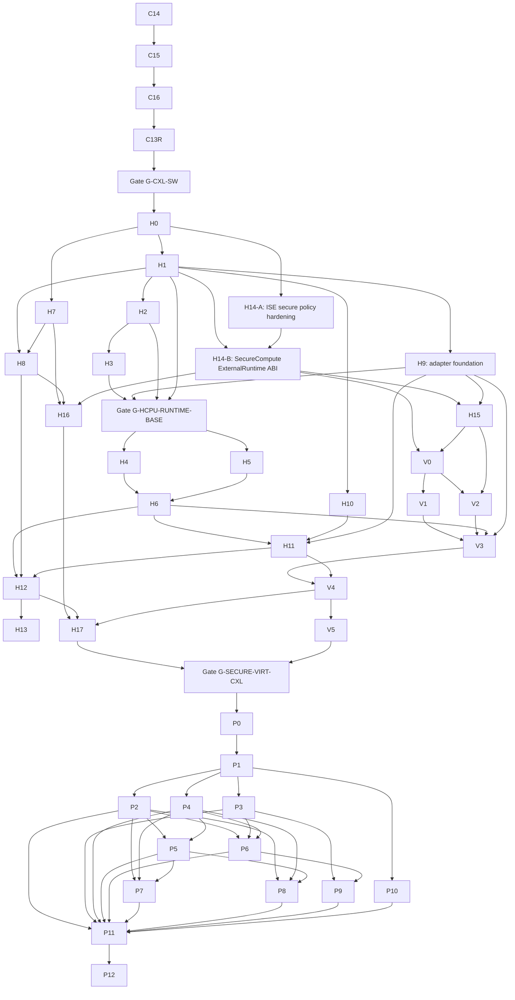

# SingNextOS Master Refactoring Execution Plan

Status: proposed cross-roadmap execution DAG.

## 1. Purpose

This document defines the launch order, hard dependencies, convergence gates, and safe parallel execution tree for the following roadmaps:

1. `docs/cxl-refactoring-roadmap/` (`C*` below);
2. `docs/hybridcpu-cxl-refactoring-roadmap/` (`H*` below);
3. `docs/virtualization-securecompute-cxl-refactoring-roadmap/` (`V*` below);
4. `docs/post-cxl-operability-refactoring-roadmap/` (`P*` below).

The plan is intentionally **not** a concatenation of the four roadmaps. Phase numbers are local to each roadmap. Globally, work is launched when its semantic prerequisites are stable. Independent branches should execute in parallel and converge only at explicit gates.

## 2. Starting assumption

The CXL software/model roadmap is almost closed. Its own README records Phases 0–7, 9–12 and hardening Phases 14–16 as complete for the staged single-host software/model scope. Phase 8 (QEMU/FPGA/physical hardware) remains explicitly skipped and does not block the software refactoring train.

Therefore this master plan starts with a **CXL closeout/revalidation wave**, not a replay of completed CXL implementation.

The three later roadmaps are treated as not started for execution scheduling purposes even if documentation, scaffolding, or isolated mechanisms already exist in the repository.

## 3. Global invariants across every branch

No parallel branch may weaken these rules to unblock itself:

- evidence != authority;
- replay certificate != runtime permission;
- coherence != ownership;
- completion != visibility != publication;
- publication != ownership return;
- provider unavailable != provider resources closed != provider effect contained;
- stale generation fails closed before the next provider effect or, if the effect already happened, before publication/reclaim;
- ambiguous external effects retain the authority/pins needed for later closure or containment;
- CXL topology remains below generic application, compiler, and guest authority;
- VirtualDomain and SecureDomain remain separate authority roots;
- compiler metadata and manifests express requirements but never mint runtime authority;
- zero-copy/direct coherent output are optimizations, not ABI promises;
- no post-CXL work may compensate for a missing earlier invariant by creating a second authority store.

## 4. Phase identifiers

### CXL closeout

- `C14` — audit hardening and reclaim closure.
- `C15` — provider effect containment and Fabric Manager atomicity.
- `C16` — fabric exactness and generic effect containment.
- `C13R` — refresh/re-run final software validation after the latest hardening state. This is a closeout gate, not a new feature phase.

Earlier CXL phases remain prerequisites by inheritance but are not rescheduled here. `C8` remains outside software completion scope unless a separate hardware-validation program is opened.

### HybridCPU / compiler roadmap

- `H0` baseline/gap matrix.
- `H1` cross-project runtime contract.
- `H2` legality/GuardPlane/external authority separation.
- `H3` replay/effect model and invalidation.
- `H4` lane7 L7-SDC external-operation bridge.
- `H5` lane6 DmaStreamCompute integration.
- `H6` commit/visibility/publication/fences.
- `H7` compiler IR semantic intent.
- `H8` compiler lowering/admission/bundling.
- `H9` ExternalRuntime SingNextOS adapter.
- `H10` CXL memory/coherent-access semantics.
- `H11` fault/reset/reconfiguration/cancellation.
- `H12` validation/negative tests/conformance for the base external-execution contour.
- `H13` migration order/base contour exit criteria.
- `H14` SecureCompute ExternalRuntime contract + exhaustive secure-operation policy hardening.
- `H15` child/secure composition + virtual-event publication.
- `H16` compiler secure/virtual intent and CXL boundary.
- `H17` final cross-project secure/virtual/CXL validation and feature-promotion gate.

### SingNextOS secure virtualization roadmap

- `V0` `SecureExecutionBinding` authority composition.
- `V1` secure guest memory + CXL Type-3 composition.
- `V2` VirtualIo/events + CXL.io.
- `V3` secure virtualized CXL Type-2 compute.
- `V4` fault/reconfiguration/teardown/reclaim orchestration.
- `V5` final secure-virtual validation matrix and exit criteria.

### Post-CXL operability roadmap

- `P0` technical specification/readiness review; no production behavior by itself.
- `P1` foundation contracts + declarative manifests.
- `P2` capability-aware service supervisor.
- `P3` authority inspector/provenance graph.
- `P4` typed deadlines/cancellation/timeouts.
- `P5` budgets/quotas/admission QoS.
- `P6` deterministic tracing + OS-boundary replay.
- `P7` safe high-performance IPC v2.
- `P8` ordinary-domain checkpoint/restore.
- `P9` structured telemetry/evidence projection.
- `P10` provider conformance/fault-injection framework.
- `P11` cross-cutting integration/performance/hardening.
- `P12` final qualification and exit criteria.

## 5. Global execution DAG



`H14-A` / `H14-B` are implementation slices of roadmap Phase 14, not new roadmap phases. The split is necessary because the final cross-project roadmap explicitly requires secure policy hardening before feature promotion, while the ExternalRuntime ABI can then be implemented against that fail-closed policy model.

## 6. Wave-by-wave launch plan

### Wave 0 — CXL closeout and software baseline

Launch order:

```text
C14 -> C15 -> C16 -> C13R -> G-CXL-SW
```

Since C14–C16 are already documented as complete, this wave should normally be a **delta revalidation**, not implementation churn:

- ensure the current `master` still contains exact-generation destructive operations;
- revalidate `ProviderUnavailable` never acts as closure;
- revalidate ambiguous provider effects pin dependent authority;
- verify Fabric Manager admission/drain atomicity and exact binding identity;
- rerun the final software validation matrix against the actual current head;
- update stale evidence/docs only where code has moved;
- keep `DirectCoherentWrite` FutureGated;
- do not make skipped C8 hardware work a blocker for the software train.

**Gate G-CXL-SW:** no later branch may assume a weaker CXL effect/closure model than the C16 baseline.

### Wave 1 — freeze HybridCPU architecture, then fan out

Mandatory first phase:

```text
G-CXL-SW -> H0
```

`H0` freezes existing CPU legality, GuardPlane, replay, lane6/lane7, ExternalRuntime, compiler and publication behavior before production changes.

After `H0`, launch three parallel tracks:

#### Track 1A — ExternalRuntime foundation

```text
H1 -> H9 foundation
```

`H9` is numbered later in the roadmap but its adapter skeleton should start immediately after `H1`, matching the roadmap's own PR slicing guidance. Production wiring completes later as H4/H5/H6 consumers arrive.

#### Track 1B — compiler semantics

```text
H7
```

`H7` can run in parallel with H1/H9 because it defines provider-neutral intent. It must not invent contract fields that conflict with H1; cross-review is required before H8.

#### Track 1C — SecureCompute policy hardening

```text
H14-A
```

Make secure-operation dispatch exhaustive and deny-by-default before advertising any new secure external path. This work is mostly independent of lane6/lane7 migration and should not wait for them.

### Wave 2 — authority/replay safety + compiler lowering + secure ABI

Launch when H1 is stable:

```text
H2 -> H3
H7 + H1 -> H8
H14-A + H1 -> H14-B
H1 -> H10
H1 -> H9 continuing
```

Parallelism:

- `H2/H3` is the CPU safety track;
- `H8` is the compiler/lowering track;
- `H14-B` is the secure ExternalRuntime ABI track;
- `H10` is the provider-neutral CXL memory/coherence semantics track;
- `H9` continues adapter lifecycle/version/generation work.

Do **not** launch production lane6/lane7 migration until `H1 + H2 + H3 + H9-foundation` are merged. This follows the HybridCPU roadmap rule that production migration waits for contract, legality separation and duplicate-submit/replay prevention.

**Gate G-HCPU-RUNTIME-BASE:** H1, H2, H3 and the required H9 adapter foundation are stable and negative-tested.

### Wave 3 — parallel lane migration + secure contract composition

From `G-HCPU-RUNTIME-BASE`, launch in parallel:

```text
H4  lane7 L7-SDC migration
H5  lane6 DSC migration
```

These must remain distinct execution contours and should be owned by separate implementation branches/PRs where practical.

In parallel, after H14-B and H9 contract support:

```text
H15 child + secure composition / event forwarding
```

Also continue:

```text
H16 compiler secure/virtual intent
```

`H16` may start once H7/H8 and H14-B are stable, but its final contract must align with the exact composition shape from H15. Therefore it may develop in parallel with H15 but should merge after the H15 contract shape is frozen.

### Wave 4 — publication/fault base and first Sing secure overlay

Converge lane work:

```text
H4 + H5 -> H6
H6 + H9 + H10 -> H11
```

`H6` establishes shared completion/visibility/publication/fence semantics. `H11` then makes reset, reconfiguration and cancellation stage-sensitive across the real migrated paths.

At the same time, once H14-B and H15 are usable, launch SingNextOS secure virtualization:

```text
H14-B + H15 -> V0
```

`V0` may therefore execute in parallel with H6/H11. It must stay fail-closed when the positive HybridCPU secure capability is absent.

### Wave 5 — split Sing secure resources into two parallel branches

After V0:

```text
V0 -> V1  secure guest memory / Type-3
V0 + H15 -> V2  VirtualIo/events / CXL.io
```

Run `V1` and `V2` in parallel.

`V1` owns exact same-lineage secure guest mapping and CXL Type-3 backing lifetime.

`V2` owns CXL.io -> DeviceLease -> bounded VirtualIo and the rule that guest events occur only after publication. It depends on H15 event forwarding.

Do not start V3 production provider effects until **both** resource branches are complete enough to supply exact mappings and I/O authority.

### Wave 6 — secure virtualized Type-2 convergence

Convergence gate:

```text
V1 + V2 + H6 + H9 -> V3
```

V3 is the first phase that joins exact VirtualDomain, SecureExecutionBinding, guest mappings, VirtualIo/DeviceLease and CXL Type-2 generation/security state into one effect admission snapshot.

In parallel, finish the HybridCPU base contour qualification:

```text
H6 + H8 + H11 -> H12 -> H13
```

`H12/H13` may finish while V3 is being implemented. They close the base external-execution contour; they do not by themselves promote ProductionSecure.

### Wave 7 — joint CXL/VM/Secure fault orchestration

Convergence:

```text
V3 + H11 -> V4
```

V4 is intentionally delayed until HybridCPU stage-sensitive reset/cancellation semantics exist. It becomes the common fail-closed orchestration layer for:

- CXL hot-remove;
- Fabric Manager drain/reconfiguration;
- backing/security generation changes;
- device reset;
- VirtualIo loss;
- secure policy loss;
- teardown/reclaim with ambiguous provider closure.

### Wave 8 — final cross-project qualification

Launch together:

```text
H12 + H16 + V4 -> H17
V4 -> V5
```

Treat H17 and V5 as one **cross-project release gate** even though they live in separate roadmaps.

Required outcome:

- compiler semantic intent reaches exact HybridCPU legality/runtime contracts;
- exact Sing virtual + secure authority is materialized;
- CXL provider effects are admitted with exact generations;
- completion -> visibility -> revalidation -> publication -> guest event order is proven;
- stale/ambiguous paths never reclaim still-referenceable resources;
- `ProductionSecure` is promoted only after owner-bound enforcement and exact closure tests pass.

**Gate G-SECURE-VIRT-CXL:** H17 and V5 both pass. This is the hard prerequisite for production implementation of the post-CXL operability roadmap.

## 7. Post-CXL launch tree

The post-CXL roadmap explicitly assumes CXL, HybridCPU, Virtualization and SecureCompute are completed prerequisites. Therefore production work begins only after `G-SECURE-VIRT-CXL`.

Documentation, API sketches, test harness stubs and benchmark scaffolding may be prepared earlier, but must not merge production behavior that depends on unproven prerequisites.

### Wave 9 — operational foundation

```text
G-SECURE-VIRT-CXL -> P0 -> P1
```

`P0` is a readiness/spec review. `P1` establishes one common manifest/lifecycle/dependency vocabulary.

After P1, four branches can launch in parallel:

```text
P2 supervisor
P3 authority inspector
P4 deadlines/cancellation
P10 provider conformance/fault injection
```

This is the highest-value parallel fan-out in the post-CXL roadmap.

### Wave 10 — budgets and causal diagnosis

Budget admission needs stable service/deadline ownership:

```text
P2 + P4 -> P5
```

Tracing can begin once service identity, provenance and cancellation lifecycle are available:

```text
P2 + P3 + P4 -> P6
```

`P10` continues independently and should continuously qualify new provider-facing changes rather than waiting until the end.

### Wave 11 — three-way parallel productization

After P2/P4/P5 are stable, launch:

```text
P7 IPC v2
P8 ordinary checkpoint/restore
```

They can run in parallel because checkpoint does not require IPC v2 as an authority prerequisite; any IPC state that cannot yet be checkpointed must be explicitly classified unsupported rather than guessed.

Telemetry can proceed in parallel once provenance + tracing schemas are stable:

```text
P3 + P6 -> P9
```

Thus Wave 11 can have three active implementation branches plus the long-running P10 conformance branch.

### Wave 12 — integrated hardening and final qualification

Only after P2–P10 are complete enough to expose their production contracts:

```text
P2..P10 -> P11 -> P12
```

P11 owns integration/performance/abuse-resistance work; P12 owns the final negative matrix and Definition of Done.

## 8. Complete phase launch matrix

| Phase | Hard launch prerequisites | Can run in parallel with | Must converge before |
|---|---|---|---|
| C14 | existing CXL 0–12 baseline | none for closeout | C15 |
| C15 | C14 | none for closeout | C16 |
| C16 | C15 | none for closeout | C13R |
| C13R | C16/current master | none | G-CXL-SW |
| H0 | G-CXL-SW | none initially | all Hybrid branches |
| H1 | H0 | H7, H14-A | H2/H9/H14-B/H8 handshake |
| H2 | H1 | H7/H8, H9, H14 | H3 and runtime base gate |
| H3 | H2 + H1 | H8/H9/H14/H10 | H4/H5 production migration |
| H4 | G-HCPU-RUNTIME-BASE | H5, H15/H16 | H6/H12 |
| H5 | G-HCPU-RUNTIME-BASE | H4, H15/H16 | H6/H12 |
| H6 | H4 + H5 | V0/V1/V2, H16 | H11/V3/H12 |
| H7 | H0; align with H1 | H1/H2/H14 | H8/H16 |
| H8 | H7 + H1 stable semantic contract | H2/H3/H14/H10 | H12/H16 |
| H9 | H1; production completion also consumes migrated callers | H2/H3/H7/H14 | H4/H5, H15, H11, V3 |
| H10 | H1 + CXL software baseline | H2/H3/H7/H14 | H11 |
| H11 | H6 + H9 + H10 | V0/V1/V2/H16 | V4/H12 |
| H12 | H4/H5/H6/H8/H9/H11 | V3/V4 | H13/H17 |
| H13 | H12 | V3/V4/H16 | base contour closeout |
| H14 | H0; H14-B also requires H1 and H14-A | H7/H8/H2/H3 | H15/V0/H16 |
| H15 | H14-B + H9 event/runtime support | H4/H5/H6/H16 | V0/V2/H17 |
| H16 | H7 + H8 + H14-B; final alignment with H15 | H15/V0/V1/V2 | H17 |
| H17 | H12 + H16 + V4 | V5 | G-SECURE-VIRT-CXL |
| V0 | H14-B + H15 | H6/H11/H16 | V1/V2 |
| V1 | V0 + CXL software baseline | V2/H11/H16 | V3 |
| V2 | V0 + H15 | V1/H11/H16 | V3 |
| V3 | V1 + V2 + H6 + H9 | H12/H13/H16 | V4 |
| V4 | V3 + H11 | H12/H13 | H17/V5 |
| V5 | V4 + cross-project harness | H17 | G-SECURE-VIRT-CXL |
| P0 | G-SECURE-VIRT-CXL | none required | P1 readiness |
| P1 | P0 | none initially | all post-CXL branches |
| P2 | P1 | P3/P4/P10 | P5/P6/P7/P8/P11 |
| P3 | P1 | P2/P4/P10 | P6/P9/P11 |
| P4 | P1 | P2/P3/P10 | P5/P6/P7/P8/P11 |
| P5 | P2 + P4 | P6/P10 | P7/P8/P11 |
| P6 | P2 + P3 + P4 | P5/P10 | P9/P11 |
| P7 | P2 + P4 + P5 | P8/P9/P10 | P11 |
| P8 | P2 + P4 + P5 | P7/P9/P10 | P11 |
| P9 | P3 + P6 | P7/P8/P10 | P11 |
| P10 | P1 stable lifecycle contracts | P2–P9 | P11 |
| P11 | P2–P10 production contracts | none except test cleanup | P12 |
| P12 | P11 | none | roadmap completion |

## 9. Recommended parallel team tree

With four independent implementation streams, use this allocation:

### Stream A — HybridCPU runtime/ISE

```text
H0 -> H1 -> H2 -> H3 -> H4/H5 coordination -> H6 -> H11 -> H12
       \-> H9 continuously
       \-> H14 -> H15
```

### Stream B — compiler

```text
H0 -> H7 -> H8 -> H16 -> compiler side of H17
```

### Stream C — SingNextOS secure virtualization/CXL composition

```text
wait for H14/H15 contract gate
 -> V0
 -> V1 + V2
 -> V3
 -> V4
 -> V5
```

### Stream D — conformance/integration

Start early with reusable fake adapters and negative matrices. It should continuously validate H1/H2/H3/H9/H14 and later own H12/H17/V5 convergence. Do not wait until the end to build the test harness.

After `G-SECURE-VIRT-CXL`, reassign the streams to:

```text
A: P2 supervisor -> P5 budget integration
B: P3 inspector -> P6 trace -> P9 telemetry
C: P4 cancellation -> P7 IPC -> P8 checkpoint support/integration
D: P10 provider conformance -> P11/P12 qualification
```

P7 and P8 should still be separate PR branches even if one team owns both.

## 10. Critical path

The approximate semantic critical path is:

```text
C14 -> C15 -> C16 -> C13R
 -> H0 -> H1 -> H2 -> H3
 -> H4/H5 -> H6 -> H11
 -> H14/H15 -> V0 -> V1/V2 -> V3 -> V4
 -> H17/V5
 -> P1 -> P2 -> P5
 -> P7/P8
 -> P11 -> P12
```

This is not a literal single-thread schedule. `H14/H15`, compiler H7/H8/H16, H9 adapter work, V0 preparation, and P10-style test infrastructure should overlap wherever their hard gates permit.

The highest-risk convergence points are:

1. `H1/H2/H3/H9` — external authority versus CPU legality/replay.
2. `H4/H5 -> H6` — two execution contours sharing publication semantics without being merged.
3. `H14/H15 -> V0` — ProductionSecure external contract and exact secure+virtual composition.
4. `V1/V2 -> V3` — exact memory and I/O authority joining one Type-2 effect.
5. `V3 + H11 -> V4` — fault/reconfiguration orchestration.
6. `H17 + V5` — feature promotion and reclaim correctness.
7. `P2/P4/P5` — managed service identity, cancellation and accounting becoming one operational model.
8. `P2–P10 -> P11` — post-CXL integration without duplicating authority facts.

## 11. Branch/PR policy

Use small contract-first PRs and preserve branch independence where the DAG allows it.

Rules:

- one PR should normally implement one roadmap phase or one explicitly documented sub-slice;
- parallel branches must target `master` or a deliberately declared contract branch, never silently stack on an unrelated implementation branch;
- if two branches need the same contract, land the contract first, then rebase both consumers;
- test/conformance PRs may precede implementation as failing/disabled harnesses only if repository policy allows it and they do not claim completion;
- no branch may enable a feature flag before its convergence gate is met;
- `ProductionSecure` promotion belongs at H17/V5 convergence, not H14 contract creation;
- post-CXL production branches must not merge before G-SECURE-VIRT-CXL, although preparatory non-production work may be developed earlier;
- every phase closes with its own negative tests before downstream consumers treat it as stable.

## 12. Merge gates and go/no-go criteria

### G-CXL-SW

Go only when the current head still proves C14/C15/C16 effect containment, exact identity and reclaim rules. C8 hardware work is not required.

### G-HCPU-RUNTIME-BASE

Go only when CPU legality, OS authority and replay evidence are separate; duplicate external submit is impossible; adapter lifecycle/versioning is stable enough for lane consumers.

### G-SECURE-ABI

Implicit sub-gate before V0:

```text
H14-B + H15 contract shape + H9 support
```

Go only when HybridCPU exposes owner-bound secure lifecycle/closure and exact child+secure composition/event contracts. Do not infer this gate from internal ISE secure descriptors.

### G-SECURE-VIRT-CXL

Go only when H17 and V5 prove the complete compiler -> HybridCPU -> SingNextOS -> CXL -> publication -> guest event -> closure path, including stale and ambiguous cases.

### G-POST-CXL-FOUNDATION

After P1, manifests/dependency vocabulary are stable and non-authoritative. Only then fan out P2/P3/P4/P10.

### G-OPERABILITY-FINAL

P12 closes the complete post-CXL program only after integrated service restart, cancellation, budget accounting, IPC ownership, checkpoint freshness, telemetry visibility and provider failure semantics are jointly qualified.

## 13. What must not block the train

Unless separately promoted into scope, do not block this plan on:

- CXL Phase 8 QEMU/FPGA/physical-hardware qualification;
- DirectCoherentWrite;
- guaranteed zero-copy ABI;
- secure writable multi-host CXL memory;
- secure CXL P2P;
- transparent confidential migration;
- nested confidential domains;
- guest-visible hardware-attestation claims without owner-bound enforcement.

These remain FutureGated and should not be smuggled into critical-path phases.

## 14. Final recommended launch order in compact form

```text
0. CXL closeout: C14 -> C15 -> C16 -> C13R

1. H0

2. Parallel fan-out:
   A: H1 -> H9 foundation -> H2 -> H3
   B: H7 -> H8
   C: H14-A -> H14-B
   D: H10

3. After runtime-base gate, parallel:
   A: H4
   B: H5
   C: H15
   D: H16

4. Converge runtime:
   H4 + H5 -> H6 -> H11

5. Secure Sing branch:
   H14 + H15 -> V0 -> {V1 || V2} -> V3

6. Fault convergence:
   V3 + H11 -> V4

7. Base and secure validation in parallel:
   H6/H8/H11 -> H12 -> H13
   H12/H16/V4 -> H17
   V4 -> V5

8. H17 + V5 -> G-SECURE-VIRT-CXL

9. Post-CXL:
   P0 -> P1
   -> {P2 || P3 || P4 || P10}
   -> {P5 || P6}
   -> {P7 || P8 || P9 || P10}
   -> P11 -> P12
```

This ordering maximizes parallel execution while preserving the authority, replay, publication, generation, closure and reclaim dependencies defined by the four source roadmaps.